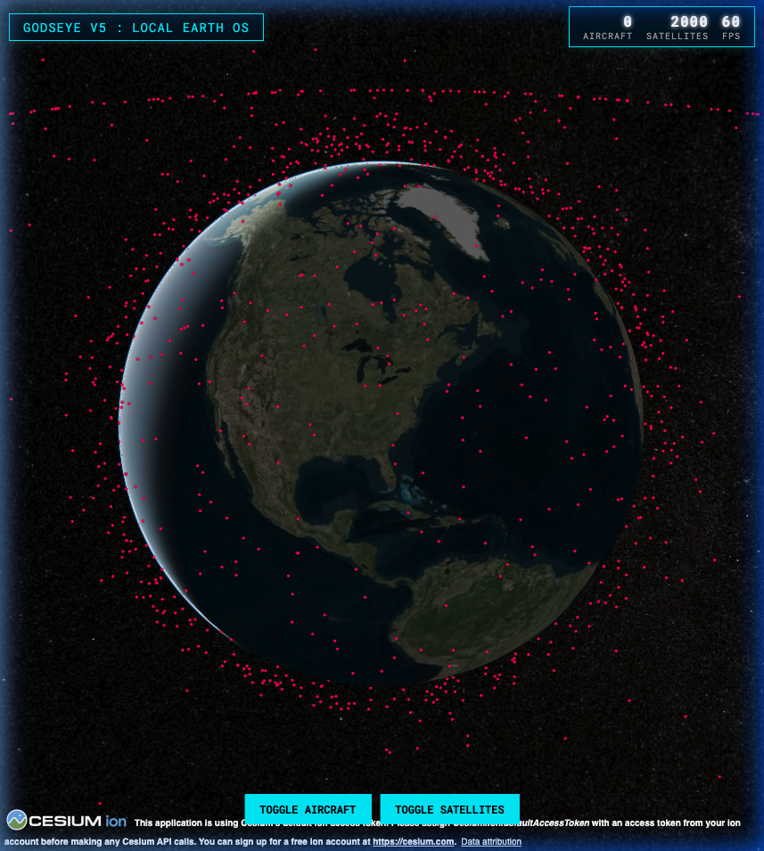
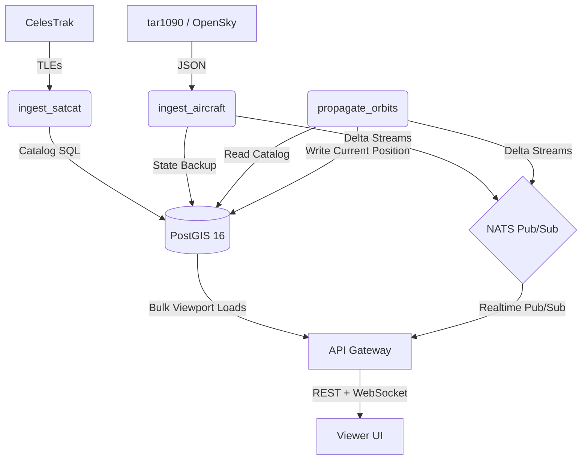

# Godseye: Local Earth OS



Godseye v5 transforms real-time geospatial tracking into a containerized "Local Earth OS." By utilizing a high-frequency NATS streaming backbone, PostGIS spatial awareness, and a React/Vite web layer powering CesiumJS, the architecture effortlessly simulates and renders continuous flight tracking and thousands of SGP4-propagated satellites at 60 FPS, entirely on your local machine.

## Architecture

The platform has migrated from a monolith into five specialized microservices orchestrated by Docker Compose:

- **`ingest_aircraft`**: Reads live terrestrial/ADS-B tracks from a local `tar1090` instance or the OpenSky Network, upserting highly normalized events.
- **`ingest_satcat`**: Replicates active CelesTrak master catalogs (TLEs) into local relational memory every 6 hours.
- **`propagate_orbits`**: The orbital physics worker. Constantly streams current orbital states derived via PySGP4 math into the message bus.
- **`api` (FastAPI)**: Serves spatial aggregations from PostGIS and broadcasts massive sub-second coordinate delta manifolds via WebSockets.
- **`viewer` (Vite/CesiumJS)**: High-performance 3D visualization. Rather than updating thousands of heavy DOM entities, the frontend digests pure delta packets into Cesium primitive collections.



## Quick Start (Docker)

Ensure Docker Desktop (or Colima) is running.

```bash
# 1. Clone & enter directory
git clone https://github.com/dawsonblock/Godseye.git
cd Godseye

# 2. Add local configuration (optional API keys)
cp ops/sample_env/.env .env

# 3. Boot the Cluster
docker-compose up --build -d
```

### Access Points

- **Frontend App**: [http://localhost:5173](http://localhost:5173)
- **API Health**: [http://localhost:8000/health](http://localhost:8000/health)
- **Postgres Database**: `localhost:5432` (`godseye:godseye`)

## Technical Stack

- **Database**: PostgreSQL 16 + PostGIS 3.4 (ARM64 `kartoza` build natively supported)
- **Transport**: NATS Core (ephemeral in-memory multi-cast)
- **Language**: Python 3.11, JavaScript (ES6)
- **Frameworks**: FastAPI, asyncpg, NATS-py, Vite, CesiumJS
